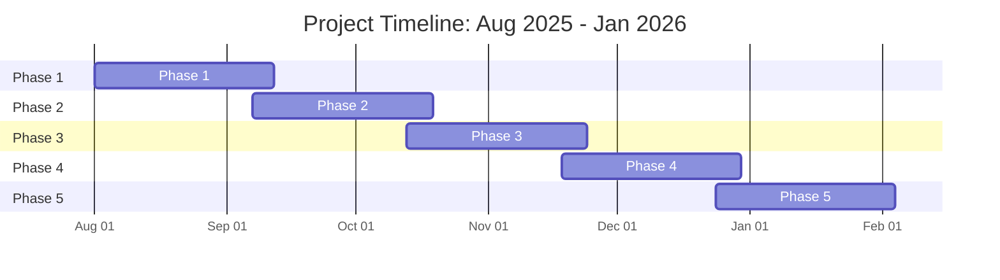

# Creating diagrams

GitHub Copilot Chat can help you create diagrams to better understand your data and communicate insights.

GitHub Copilot Chat on GitHub.com can help you create Mermaid diagrams to visualize data, making it easier to understand and communicate insights. You can ask Copilot Chat to generate diagrams based on your data or code, and it will provide you with the necessary code to create those diagrams.

## Example scenario

You want to create a Gantt chart to visualize the timeline of a project. You can ask Copilot Chat on GitHub.com to generate the Mermaid code for the Gantt chart, with specific details about the project phases and their durations. You can then use this code in any Markdown file that supports Mermaid syntax, such as issues, discussions, or pull requests on GitHub.

## Example prompt

```copilot copy prompt
Create a Mermaid Gantt diagram that covers the period August 1st 2025 until January 31st, 2025. Include 5 phases, each taking 6 weeks, and overlapping equally.
```

## Example response

> \[!NOTE] The following response is an example. Copilot Chat responses are non-deterministic, so you may get a different response from the one shown here.

Copilot will provide you with the Mermaid code to create the flowchart. You can copy the code Copilot Chat provides and paste it anywhere on GitHub that supports Markdown, such as an issue or discussion.

Ensure you include the correct Mermaid syntax of ` ```mermaid ` before and ` ``` ` after the code block to render the diagram correctly.

````text

````

This Mermaid code would generate the following diagram:


## Further reading

* [Mermaid documentation](https://mermaid-js.github.io/mermaid/#/)
* [GitHub Copilot Chat documentation](/en/copilot/how-tos/use-chat)